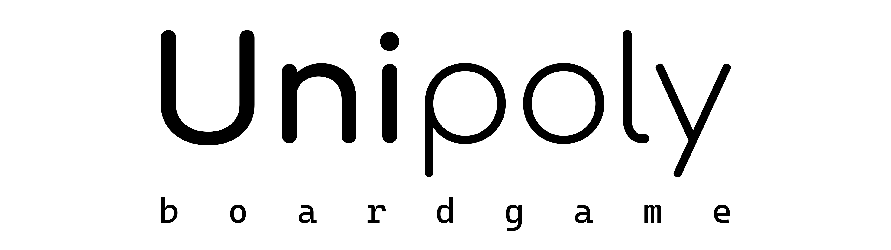

> Project files are stored on GitLab due to GitHub LFS restrictions. [Here is a link to the source repository.](https://gitlab.com/elzzzdev/unipoly)

[](https://gitlab.com/elzzzdev/unipoly)

<p align="center">
  <a href=""></a> &nbsp;
  <a href=""></a> &nbsp;
  <a href=""></a> &nbsp;
  <a href=""></a> &nbsp;
</p>

## Code Style
This project's objective is to learn how to create game with a competent and correct architecture. Therefore, I rely on the following rules:
- [Gamemakin Style Guide](https://github.com/Allar/ue5-style-guide)
- [BenUI's Unreal UI Best Practices](https://benui.ca/unreal/ui-best-practices)
- [Epic C++ Coding Standard For Unreal Engine](https://docs.unrealengine.com/5.3/en-US/epic-cplusplus-coding-standard-for-unreal-engine/)
- Class Organization Pattern
  
Class organization has a pretty poor description in Epic Coding Standard, and it fits in just a few lines:
> Classes should be organized with the reader in mind rather than the writer. Since most readers will use the public interface of the class, the public implementation should be declared first, followed by the class's private implementation.

Here is a header organization sample I use for this project:
```c++
UCLASS()
class UNIPOLY_API AExampleActor : public AActor
{
    GENERATED_BODY()

    // Actor components block - private by default
    UPROPERTY(EditAnywhere)
    UStaticMeshComponent* StaticMeshComponent;

public:
    // Constructor and destructor first
    AExampleActor();

    // All public overrides from parent
    virtual void Tick(float DeltaTime) override;

    // Personal public methods and attributes
    UFUNCTION()
    UStaticMeshComponent* GetStaticMeshComponent() const;

protected:
    // All protected overrides from parent
    virtual void BeginPlay() override;

    // Personal protected methods and attributes
    UPROPERTY()
    bool bHasFadedIn;
};
```